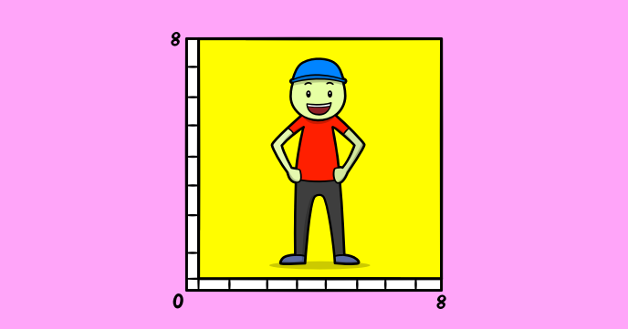

Learn about binary and character representation while implementing this useful character editor. The tool can be useful in defining custom sprite characters for your games.

There are other tutorials on CodeGuppy that shows you how to use custom sprites in your programs.
 
## Source code 
The JavaScript source code of this program can be found [here](sketches/program.js). To run it, you need to import it in the [codeguppy.com](https://codeguppy.com) online editor. Alternatively, you can use the source code in your p5.js sketches (advanced use). 
## Online version 
To see the code running, check the online playground at [https://codeguppy.com/code.html?t=char_editor](https://codeguppy.com/code.html?t=char_editor) 
## Next steps 
Please check [codeguppy.com](https://codeguppy.com) for many other fun JavaScript programs and games for beginners. To stay up to date with CodeGuppy development please follow [@codeguppy](https://twitter.com/codeguppy) on Twitter.  
